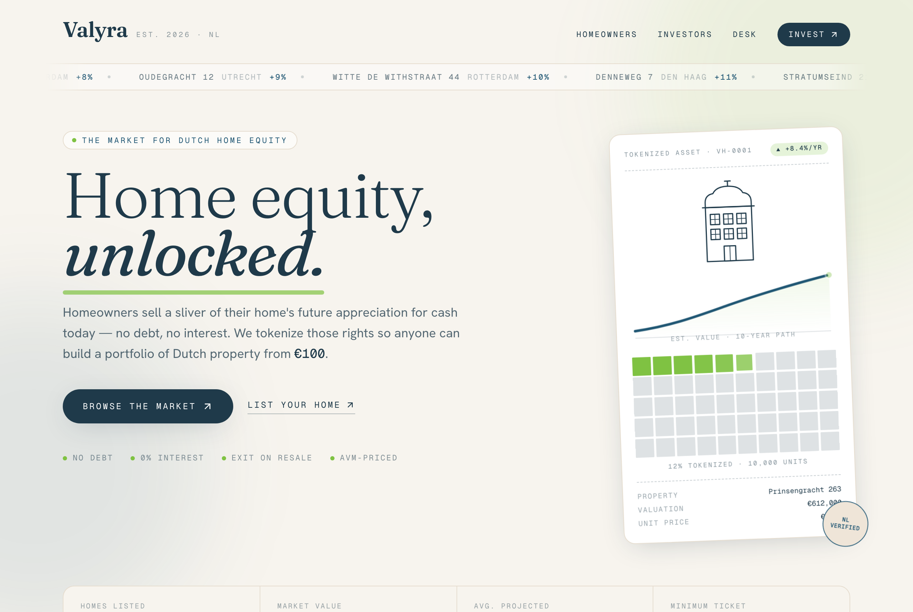
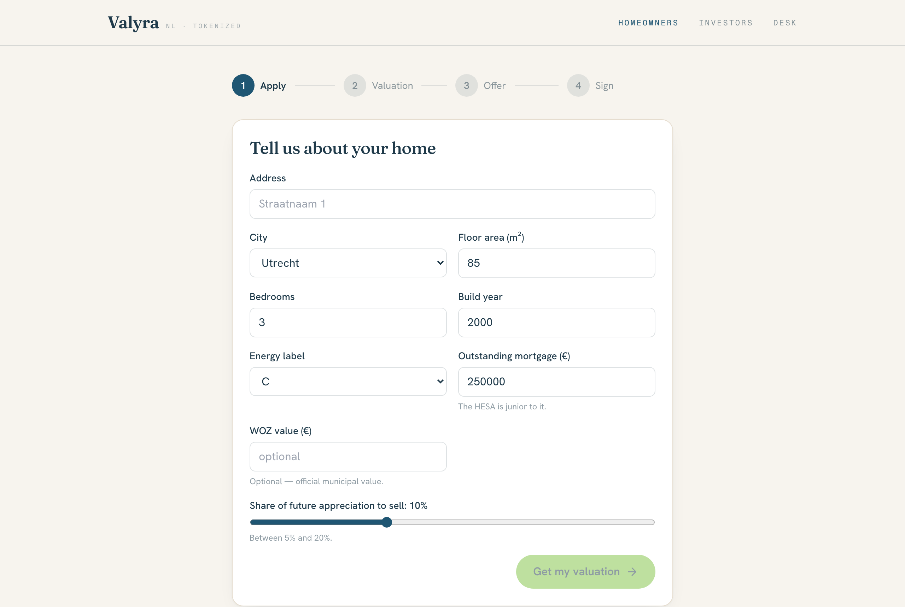
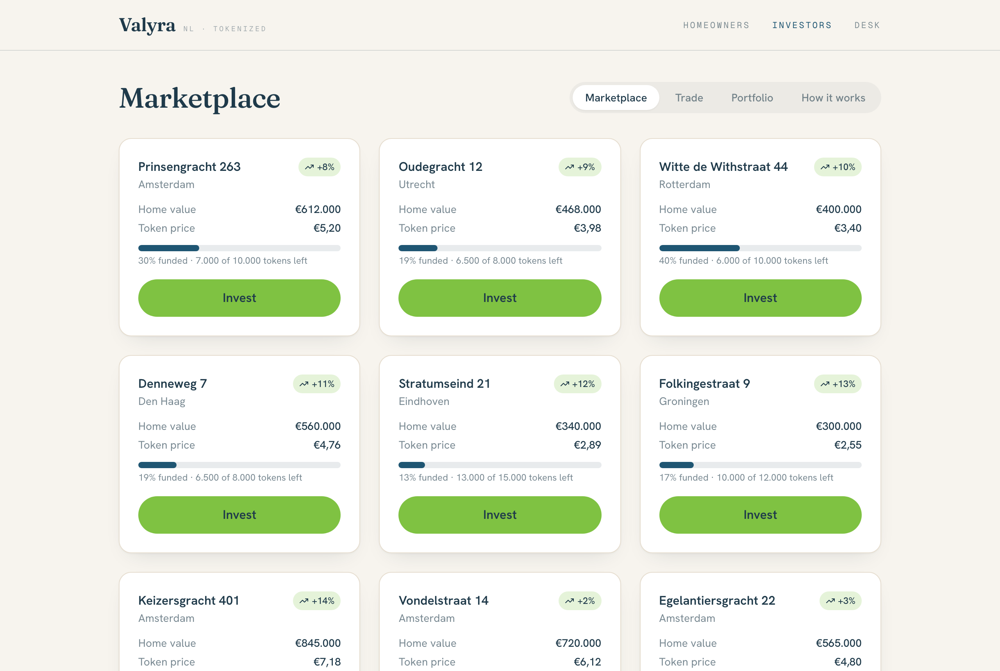
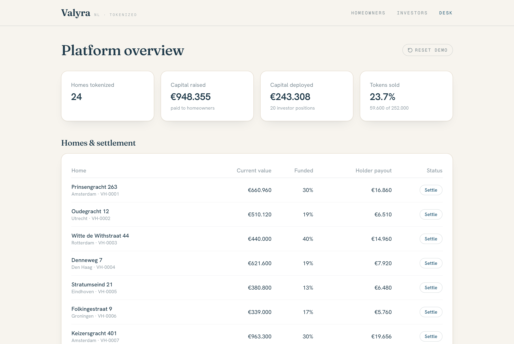

# Valyra — Home equity, unlocked

> **Tokenized home-equity sharing for the Netherlands — retail-accessible from €100.**

**Valyra** is a FinTech MVP that brings **home-equity sharing agreements (HESAs)**
to the Netherlands and makes them **retail-accessible through tokenization**.
Dutch homeowners sell a fraction of their home's **future appreciation** for cash
today — **no debt, no interest, no monthly payments**. Those appreciation rights
are **tokenized**, so retail investors can buy fractional shares from as little as
**€100**. Think of the US players **Point** and **Unison**, brought to the
Netherlands and opened up to small investors.

<p align="center"></p>

[](https://github.com/Franreal123/valyra-mvp/actions/workflows/ci.yml)


-1f5673)

> 🎓 Built as a university FinTech assignment. The blockchain and the AVM
> (Automated Valuation Model) are **simulated in the backend** — there is no real
> chain connection. See [`docs/simulated-vs-real.md`](docs/simulated-vs-real.md).

---

## The opportunity (for investors)

- **A trapped asset class.** Dutch households hold enormous wealth in home
  equity, but it's illiquid — you can only access it through debt (a second
  mortgage) or by selling. HESAs unlock it with **no debt and no monthly
  payments**, aligning the provider with the homeowner: we only make money if the
  home appreciates.
- **A new retail asset.** US HESA originators (Point, Unison) prove demand but
  keep the asset wholesale — sold to funds, not people. **Valyra's wedge is
  tokenization**: fractionalising each home into tradable units so retail
  investors get exposure to residential appreciation **from €100**, with a
  secondary market for liquidity.
- **Revenue model.** Origination fee on each HESA + a management fee + a
  settlement spread — documented in [`docs/financial-model.md`](docs/financial-model.md).
- **Honest by design.** The product discloses the **downside scenario first**,
  models bear/base/bull IRR, and gates investment behind a suitability check.

## What the MVP demonstrates

Three role-scoped flows over **one shared system** — sign a home as its owner and
it instantly appears in the investor marketplace and the operator desk.

| Flow | Route | What you can do |
| --- | --- | --- |
| **Homeowner** | `/homeowner` | Apply → get an AVM valuation (with confidence band & "how we valued this") → see the cash offer → sign. The home is tokenized. |
| **Investor** | `/investor` | Browse a market of 24 tokenized homes → pass a simulated KYC/suitability gate → buy fractional tokens from €100 → track a portfolio dashboard (KPIs, allocation, one-year outlook) → resell on the secondary market → read an in-app **How it works** tab with the full risk & legal disclosures. |
| **Operator (Desk)** | `/admin` | Platform KPIs (capital raised/deployed, funded %, token supply) and per-home **settlement** (buy out token holders at current value). |

<p align="center">
  
  
  
</p>

## How the innovation maps to code

The conceptual innovation lives in small, **unit-tested, swappable modules** under
`src/lib/` — the *simulated* implementations can be replaced by real ones (a
chain, an AVM vendor, a database) **without touching the UI**.

| Concept | Module | Production swap |
| --- | --- | --- |
| AVM valuation | `lib/avm.ts` | Vendor AVM + comparables + manual review |
| Mortgage seniority (only unmortgaged equity is tokenizable) | `lib/eligibility.ts` | Same logic, verified data + lender consent |
| HESA offer + token mint | `lib/contract.ts` | ERC-1400 security tokens, KYC-restricted |
| Pricing / appreciation / supply | `lib/market.ts` | Live indices, on-chain supply |
| Risk/return projection | `lib/scenarios.ts` | Stochastic models on real data |
| Settlement & KPIs | `lib/admin.ts` | Payment rails + escrow + settlement events |
| **Data layer (the key seam)** | `lib/store.ts` | **Supabase/Postgres behind the same interface** |

The single most important architectural decision is the **`store.ts` seam**:
the whole app depends only on its function signatures, so moving from the demo's
in-memory store to a real database is one step with **zero UI changes**. Full
write-up — including the data-flow diagram and how the GUI serves the UX — in
[`docs/architecture.md`](docs/architecture.md).

## Tech stack

| Layer | Choice |
| --- | --- |
| Framework | **Next.js 14** (App Router, React Server Components) |
| Language | **TypeScript** (strict mode) |
| Styling | **Tailwind CSS** + a custom brand palette |
| Icons / charts | **lucide-react** / **recharts** |
| Data (production) | **Supabase** — wired behind `lib/store.ts` |
| Testing | **Vitest** (unit) + **Playwright** (e2e) |
| Tooling | ESLint, Prettier |

## Getting started

```bash
npm install
npm run dev          # → http://localhost:3000
```

No environment variables are needed for the demo — the chain, AVM, and store are
simulated. Full run/deploy/use guide (incl. Vercel and the Supabase swap) in
[`docs/deployment.md`](docs/deployment.md).

### Scripts

| Command | What it does |
| --- | --- |
| `npm run dev` | Start the dev server |
| `npm run build` | Production build |
| `npm run start` | Serve the production build |
| `npm run lint` | ESLint |
| `npm test` | Unit tests (Vitest) — **50 tests** |
| `npm run test:e2e` | End-to-end test (Playwright) — full cross-flow journey |

> ⚠️ Don't run `npm run build` while a `next dev`/Playwright server is writing to
> `.next` (mixed artifacts corrupt the build). Recover with
> `rm -rf .next && npm run build`.

## Testing

- **50 unit tests** cover the domain logic in `src/lib/` (AVM, contract,
  eligibility, market, scenarios, settlement, store, seed).
- **One end-to-end test** (`e2e/full-flow.spec.ts`) drives the whole thesis
  across all three roles via in-app navigation — proving the shared store:
  a homeowner signs a home → it appears in the marketplace → an investor passes
  KYC and buys → the desk settles it.

## Folder structure

```
valyra-mvp/
├── src/
│   ├── app/                # Routes: /, /homeowner, /investor, /admin (+ loading.tsx)
│   ├── components/         # ui/ primitives (Button, Field, Modal, Card) + per-flow UI
│   ├── lib/                # types, utils, and SIMULATED contract/AVM/market/settlement + the store seam
│   └── db/                 # schema + seed data
├── e2e/                    # Playwright end-to-end test
├── docs/                   # financial model, architecture, deployment, security, etc.
├── .claude/ · CLAUDE.md · AGENTS.md   # agent instructions & orchestration
└── README.md
```

## Built with AI agents

Valyra was built with **Claude Code** (Anthropic) using a disciplined
brainstorm → spec → plan → **TDD** → review → verify loop, with merges gated on
four green checks (lint, unit, build, e2e). Why that tool, how the agents were
orchestrated, and the human+AI collaboration history are documented in
[`docs/agent-orchestration.md`](docs/agent-orchestration.md); the design specs and
plans produced along the way are in [`docs/superpowers/`](docs/superpowers/).
Agent conventions live in [`CLAUDE.md`](CLAUDE.md) and [`AGENTS.md`](AGENTS.md).

## Scaling, risks & security

- **Prerequisites to scale out** and the technical risks — [`docs/architecture.md`](docs/architecture.md#prerequisites-to-scale-out-and-the-technical-risks)
- **Security** (operator & user) and operations/maintenance — [`docs/security.md`](docs/security.md)
- **Financial, legal & technical risk register** — [`docs/risk-register.md`](docs/risk-register.md)
- **Regulatory note** (MiFID II / Prospectus / MiCA, AFM/DNB, KYC/AML) — [`docs/regulatory-note.md`](docs/regulatory-note.md)

## Documentation index

| Doc | What it covers |
| --- | --- |
| [`docs/architecture.md`](docs/architecture.md) | Concept→code mapping, the data-layer seam, UX, scaling prerequisites |
| [`docs/deployment.md`](docs/deployment.md) | Run locally, deploy to Vercel, wire up Supabase, product demo |
| [`docs/security.md`](docs/security.md) | Operator & user security risks; operations & maintenance |
| [`docs/financial-model.md`](docs/financial-model.md) | HESA pricing, the discount rationale, AVM, IRR scenarios, revenue model |
| [`docs/regulatory-note.md`](docs/regulatory-note.md) | NL/EU classification, AFM/DNB, KYC/AML, retail protection |
| [`docs/risk-register.md`](docs/risk-register.md) | Financial, legal, technical & MVP-specific risks with mitigations |
| [`docs/simulated-vs-real.md`](docs/simulated-vs-real.md) | Exactly what's faked vs. how it works in production |
| [`docs/demo-script.md`](docs/demo-script.md) | ~2–3 minute end-to-end walkthrough |
| [`docs/agent-orchestration.md`](docs/agent-orchestration.md) | Which AI agents, why, and how they were orchestrated |

## Brand palette

| Token | Hex | Use |
| --- | --- | --- |
| `valyra-blue` | `#1f5673` | Primary / accent |
| `valyra-ink` | `#1f3a4a` | Text / dark surfaces |
| `valyra-lime` | `#7fc242` | Calls to action |
| `valyra-canvas` | `#f7f4ee` | Page background |

---

*Academic prototype — not investment advice and not a live financial product.
The blockchain and AVM are simulated.*
